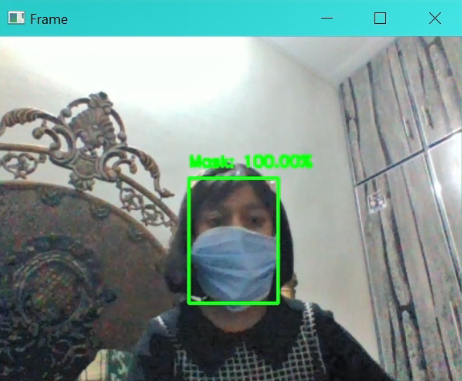
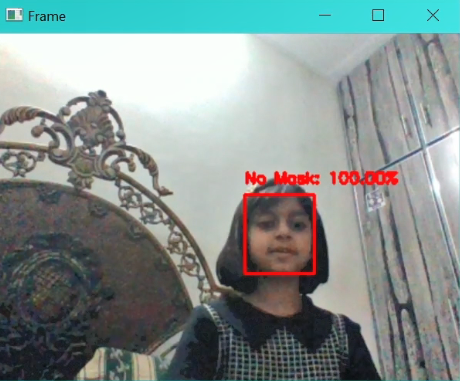

# Real-Time Face Mask Detector

## Overview

This project implements a real-time face mask detector using OpenCV and a Convolutional Neural Network (CNN) with transfer learning on the MobileNet architecture. The detector can analyze live camera feed to identify individuals wearing masks and those who are not, providing immediate visual feedback through bounding boxes and labels.

## Features

- Detects faces in real-time video streams.
- Classifies faces into "Mask" or "No Mask" categories.
- Draws green bounding boxes around faces with masks and red bounding boxes around faces without masks.

## Requirements

- Python 3.x
- OpenCV
- TensorFlow
- NumPy

## Installation

Clone the repository:

   ```bash
   git clone https://github.com/awaisnazir08/Face-Mask-Detection.git
```

## Usage

1. Navigate to the project directory:

   ```bash
   cd face-mask-detector
   ```
## Demo

### Masked Face Detection



### No Face Mask Detection



   ## Project Structure

- **train_mask_detector_colab.ipynb**: Main script for real-time face mask detection.
- **model**: Directory containing the pre-trained MobileNet model.
- **utils**: Directory containing utility functions for image preprocessing and bounding box drawing.
- **assets**: Directory for storing sample images or videos (if applicable).

## Acknowledgments

- This project was completed as part of a Computer Vision internship at The Sparks Foundation.
- Special thanks to the contributors and maintainers of OpenCV and TensorFlow.

